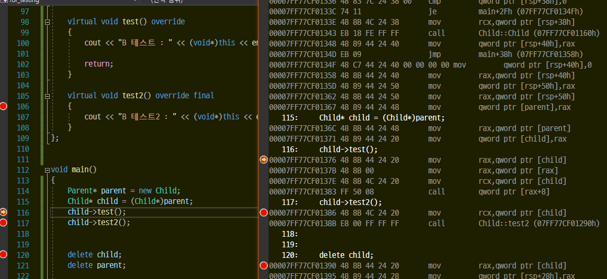

# final의 존재

객체의 메소드가 virtual이 붙어있는 메소드를 호출할때는 가상함수 테이블에 접근해서 메소드를 호출한다.

특정상황에서는 virtual을 상속받아서 구현한쪽이 가상함수 테이블을 호출하지 않도록 최적화 해준다.

조건.
1. final을 붙인다.
2. final을 붙인 객체의 포인터로 가리키고 있어야 한다.
(부모의 포인터로 가리키고 있으면 가상함수 테이블을 접근한다.)

child의 test()는 일반 가상 오버라이딩된 함수.
가상 함수 테이블을 접근해서 호출한다.
test2()는 자신의 함수를 직접 호출한다. 

가상함수 테이블을 이용하지 않아도 되므로 속도차이가 발생.