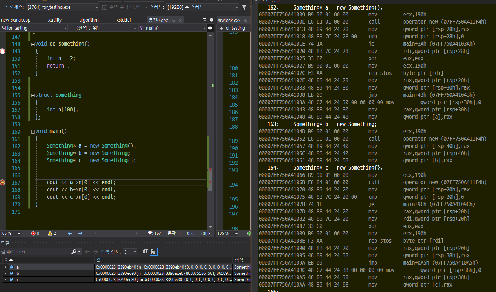

# new 멤버 초기화 선택.

예전에 LockFree Queue를 만들다가 replacement new를 사용하는 부분에서 중간 값이 발생하는 문제가 생겼다.
발생한 상황에 대해서 몇몇 상황에 대해서 최적화가 가능할것으로 보이니 기록해보기로 했다.



new 를 사용한 동적할당에서 클래스 명 뒤에 괄호 중괄호의 유무에 따라 0값으로 초기화 하는지여부가 있었다.

```cpp
struct Something
{
    int n[100];
};

void main()
{
    Something* a = new Something(); // 멤버가 0으로 초기화
    Something* b = new Something;   // 멤버 초기화 X
    Something* c = new Something{}; // 멤버가 0으로 초기화.

// 출력용
		cout << a->n[0] << endl;
    cout << b->n[0] << endl;
    cout << c->n[0] << endl;

		// replacement new시에도 초기화.
		new(b) Something{ 1 };
		//new(b) Something;  // 초기화 X
		cout << b->n[0] << endl;
}
```

OUTPUT

```cpp
0
865075536
0
1
```

## 결론

윈도우의 heap_alloc() 에서 ZERO_FLAG를 주면 초기화 되는것은 알고 있지만 그건 new 내부에서 끝날일이고 new가 종료된 이후에도 실행 되는것을 보니... 중괄호 초기화 구문이랑 관련이 있지 않을까 싶다.... 그렇다면 소괄호는 왜???

## 번외

replacement new 시에도 적용.


기본타입은 아니나 4바이트인 경우 ( 그것도 인트로 만든... )


똑같이 한바이트씩 초기화 해서 만든다 비효율적인듯