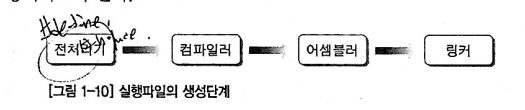

# 컴파일 과정

**전처리기**

'#define' 키워드를 치환하고, '#include' 키워드를 통해 소스 코드를 삽입하는 과정을 거친다.ㅣ

**컴파일러**

이과정에서 소스를 어셈블리어로 변환한다.

**어셈블러**

어셈블리어로 된 파일을 기계어로 변환한다.
결과물은 오브젝트 파일 ( .o , .obj )

**링커**

링커는 오브젝트 파일과 라이브러리를 결합해주는 일을 한다.

## Reference

[https://ninako21.tistory.com/456](https://ninako21.tistory.com/456)

[https://kniz.tistory.com/entry/C-기초-전방-선언](https://kniz.tistory.com/entry/C-%EA%B8%B0%EC%B4%88-%EC%A0%84%EB%B0%A9-%EC%84%A0%EC%96%B8)