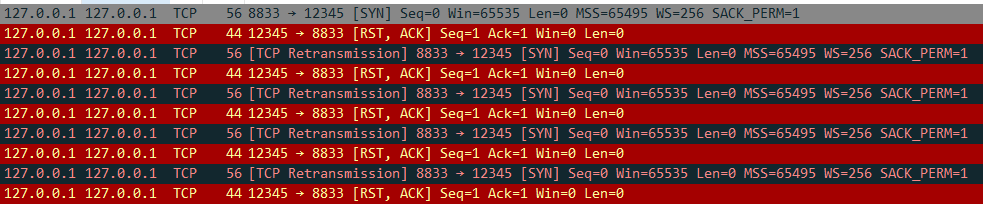

# API

## listen

- listen() 을 실행하지 않는다면?

client는 연결 시도를 진행하면 server는 RST와 ACK로 응답을 한다. 
client는 이 과정을 5회 진행후 error_code 10061를 return 한다.

**WSAECONNREFUSED**

10061 (0x274D) No connection could be made because the target machine actively refused it.
[https://docs.microsoft.com/en-us/windows/win32/debug/system-error-codes--9000-11999-](https://docs.microsoft.com/en-us/windows/win32/debug/system-error-codes--9000-11999-)

- LISTEN Queue의 크기를 0으로 만들어도 1개는 접속 할 수 있다.
단 2개는 안들어가서 연결을 취소 시킨다.

## accept()

- accept() 하지 않아도 3way-handshaking를 진행한다.
listen까지만 진행한 상황.

