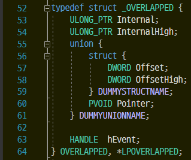

# Overlapped 구조체 초기화



minwinbas.h 파일에 정의된 Overlapped 구조체이다.

난 overlapped IO와 IOCP를 사용할때만 사용 해봤지만 윈도우에서 비동기 작업할때 사용된다.
내부를 보면 union도 있고 여러 인자로 되어 있는데 비동기 작업시 사용할 정보들이 기록되는 부분이다.

## 내부인자 설명

- Internal

OS 를 위해 예약. 시스템 의존적인 상태를 기술하는 이것은 GetOverlappedResult() 가 ERROR_IO_PENDING 의 정보에 추가적인 에러를 세팅하지 않고 리턴되었을때 유효하다.

- InternalHigh

OS 를 위해 예약.전송되어야하는 데이터의 길이를 나타내며, GetOverlappedResult() 가 true 를 반환하면 유효하다.

- Offset

파일내부에서의 전송이 시작되어야 할 위치. 이 위치는 파일의 시작점으로부터의 바이트 단위 Offset 이다. OVERLAPPED 구조체를 사용하는 프로세스가 ReadFile 이나 WriteFile 을 호출하기 전에 이 값을 설정한다. named 파이프와 커뮤케이션 디바이스와 읽고쓰기 할때는 무시된다.

- OffsetHigh

전송을 시작해야할 바이트 Offset의 상위 word.

- hEvent

전송이 완료된후 시그널될 이벤트 핸들. 이것을 호출하는 프로세스가 ReadFile, WriteFile, ConnectNamedPipe, or TransactNamedPipe() 를 호출하기전에 이 값을 설정한다.

## 사용법

비동기 작업 요청시에 멤버를 반드시 초기화하라고 MSDN 설명에 나와있다.
초기화 안할시 ERROR_INVALID_PARAMETER 이런 오류가 뜰 수 있다고 경고 하고 있다.

그래서 다들 초기화로 ZeroMemory()등으로 초기화 한다.

하지만 굳이 전부 초기화 할 필요는 없다.

작업에 따라 일부 멤버를 초기화 하지 않아도 된다.
Offset과 OffsetHigh멤버는 File IO시에 파일포인터 이동시에만 의미가 있다.

나처럼 IOCP에서 비동기 network IO시에는 InternalHigh, Internal 멤버만 초기화 해주면 된다.

### 비동기 File IO 시

```cpp
VERLAPPED  recv_overlapped;

ZeroMemory(&recv_overlapped, sizeof(OVERLAPPED));
```

### 비동기 network io시

```cpp
OVERLAPPED  recv_overlapped;

recv_overlapped.InternalHigh = 0;
recv_overlapped.Internal = 0;
```

이런식으로 쓸데 없는 함수 call을 하나씩 줄여 나가보자.